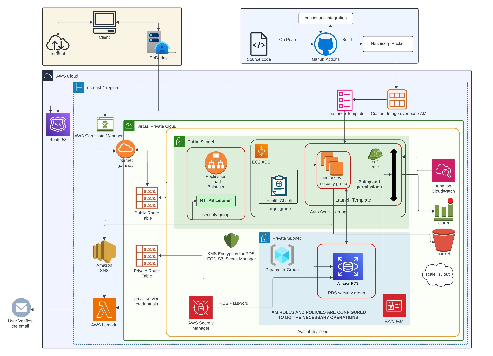

# CLOUD NATIVE WEB APPLICATION

## Description
A robust User Management Service built with Node.js and Express.js, enabling CRUD operations and email verification during user registration. Deployed on AWS, the infrastructure is provisioned using Terraform for scalability and efficiency.

Features

User Management: Comprehensive CRUD operations for managing user data.

Health Monitoring: A dedicated endpoint to track application health and connected service status.

Secure Deployment: Implements HTTPS with SSL certificates and customer-managed encryption keys to ensure data security.

Scalability and Reliability: Utilizes managed instance groups and load balancers for high availability and scalability.

Event-Driven Architecture: Sends verification emails through SendGrid by leveraging AWS SNS and Lambda Functions.

## Architecture Diagram



## Installation and Running the Application 

1. Clone the repository :

   ```bash
   git clone https://github.com/chetan1398/Cloud-Native-Web-Application-.git
   

2. Install the dependencies:
   ```bash
   npm install

3. Run the application
   ```bash
   node app.js

5. To run the Integration tests
   ```bash
   npm test

6. Endpoint URLs:

   Route to check if the server is healthy
   GET /healthz

   GET route to retrieve user details (Authenticated request)
   GET /v1/user/self

   POST route to add a new user to the database
   POST /v1/user

   PUT route to update user details (Authenticated request)
   PUT /v1/user/self

   Sample JSON Response for GET:
   ```bash
      {
      "id": "d290f1ee-6c54-4b01-90e6-d701748f0851",
      "first_name": "Jane",
      "last_name": "Doe",
      "email": "jane.doe@example.com",
      "account_created": "2016-08-29T09:12:33.001Z",
      "account_updated": "2016-08-29T09:12:33.001Z"
      }

   Status: 200 OK

   Sample JSON Request for POST:
      {
      "first_name": "Jane",
      "last_name": "Doe",
      "password": "skdjfhskdfjhg",
      "email": "jane.doe@example.com"
      }

   Status: 201 Created

   Sample JSON Request for PUT:
   {
   "first_name": "Jane",
   "last_name": "Doe",
   "password": "skdjfhskdfjhg"
   }

   Status: 204 No Content

   Responses for GET/healthz:
   ```bash
   Status: 200 OK if it is healthy and no payload
   Status: 400 Bad Request
   Status: 503 if unhealthy

   Responses for other request methods for /healthz:
   Status: 405 Method Not Allowed


7. To test the API request
   ```bash
   API Response Examples: 

   200 OK

   curl.exe -vvvv http://localhost:8080/healthz

   405 Method Not Allowed

   curl.exe -vvvv -XPUT http://localhost:8080/healthz

   503 Service Unavailable when disconnected to the database.

   curl.exe -vvvv http://localhost:8080/healthz


## TERRAFORM AWS INFRA 

This project sets up and manages AWS infrastructure using **Terraform**. The configuration files provided define the resources and variables needed to create and manage an environment in AWS.

## Setup Instructions

1. Initialize the Terraform project:

    ```bash
    terraform init

2. Format Terraform files
    ```bash
    terraform fmt

3. Validate the Terraform configuration

    ```bash
    terraform validate

4. Plan the infrastructure changes
    ```bash
    terraform plan


5. Apply the Terraform configuration
    ```bash
    terraform apply

6. Destroy the infrastructure
    ```bash
    terraform destroy


7. Import Certificate
    ```bash
    aws acm import-certificate ^
        --certificate fileb://C:\Users\cheta\Desktop\Downloads\demo_chetanwarad.me\demo_chetanwarad_me.crt ^
        --private-key fileb://C:\Users\cheta\Desktop\Downloads\demo_chetanwarad.me\privatekey.pem ^
        --certificate-chain fileb://C:\Users\cheta\Desktop\Downloads\demo_chetanwarad.me\demo_chetanwarad_me.ca-bundle ^
        --region us-east-1 ^
        --profile demo

8. List the certificate
    ```bash
    aws acm list-certificates --region us-east-1 --profile demo
    


   Developer: Chetan Warad
   NUID: 002817179
   Email: warad.c@northeastern.edu
